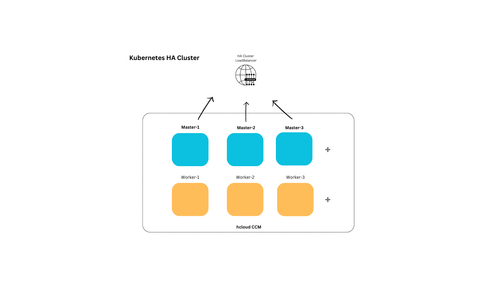

# Provisioning Kubernetes on Hetzner Cloud


This project automates the provisioning of a Kubernetes cluster on Hetzner Cloud using Terraform

1. navigate to keys/ and run the following to generate ssh keys

```bash
ssh-keygen -t ed25519
```
set the path as 

2. copy the keys to snapshot/keys folder

3. set your hcloud token on both ./terraform.tfvars.example and snapshot/terraform.tfvars.example the rename files to "terraform.tfvars"
```bash
mv terraform.tfvars.example terraform.tfvars
```

4. run terraform init & plan & apply under snaphot to generate server with the requred kubernetes packages

5. take a snapshot from the newly created server and copy the snapshot id

6. set the id on ./terraform.tfvars > image variable

7. set all other variables on terraform.tfvars

```bash
hcloud_token         = "YOUR_TOKEN"
hcloud_network_range = "10.0.0.0/8"
hcloud_subnet_range  = "10.244.0.0/16"
master_count         = 1  # use uneven numbers 1 || 3 || 5  ..
worker_count         = 1
master_type          = "cpx21"
worker_type          = "cpx31"
cni                  = "flannel"
cidr                 = "192.168.0.0/16"
image                = "SNAPSHOT_ID"
ssh_public_key_path  = "./keys/id_ed25519.pub"
ssh_private_key_path = "./keys/id_ed25519"
```
you can change them according to your need

8. review your configuration then apply 

```bash
terraform plan
terraform apply
```
9. use remote backend if needed create remote.tf file with the following  (for remote backend)

```
terraform {
  backend "remote" {
    organization = "ORG_NAME"
    workspaces {
      name = "WORKSPACE_NAME"
    }
  }
}
```

add terraform credentials under '~/.terraform.rc' (for remote backend)

```bash
credentials app.terraform.io" {
      "token": "YOUR_TOKEN"
}
```

10. set kubeconfig under .kube/config and run 
```bash
kubectl apply -f loadbalancer/nginx.yaml
```
check your loadbalancer IP and Port and you're good to go.